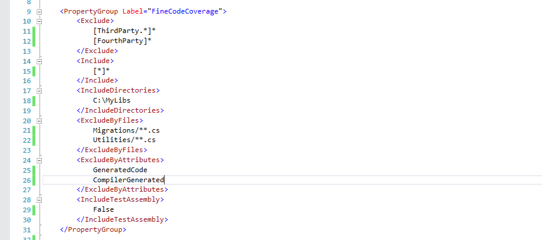

# Fine Code Coverage

[](https://ci.appveyor.com/project/FortuneN/finecodecoverage)

Download this extension from the [Visual Studio Market Place](https://marketplace.visualstudio.com/items?itemName=FortuneNgwenya.FineCodeCoverage)
or get the [CI build](https://www.vsixgallery.com/extension/fcc-f339fe606-9d51-4fca-895c-d50375137b62).

---------------------------------------

See the [change log](CHANGELOG.md) for changes and road map.

### Highlights unit test code coverage
Run a(some) unit test(s) and ...

#### Get highlights on the code being tested


#### Get highlights on the code doing the testing


#### See Coverage View


#### See Summary View


#### See Risk Hotspots View


#### Global (Shared) options


#### Local (Project) options


#### Options
```bash
Exclude                 Filter expressions to exclude specific modules and types (multiple values)
Include                 Filter expressions to include specific modules and types (multiple values)
IncludeDirectories      Include directories containing additional assemblies to be instrumented (multiple values)
ExcludeByFiles          Glob patterns specifying source files to exclude (multiple values)
ExcludeByAttributes     Attributes to exclude from code coverage (multiple values)
IncludeTestAssembly     Specifies whether to report code coverage of the test assembly
```

#### Filter Expressions
```bash
Wildcards
* => matches zero or more characters
? => the prefixed character is optional
		
Examples
[*]* => All types in all assemblies (nothing is instrumented)
[coverlet.*]Coverlet.Core.Coverage => The Coverage class in the Coverlet.Core namespace belonging to any assembly that matches coverlet.* (e.g coverlet.core)
[*]Coverlet.Core.Instrumentation.* => All types belonging to Coverlet.Core.Instrumentation namespace in any assembly
[coverlet.*.tests?] * => All types in any assembly starting with coverlet. and ending with .test or .tests (the ? makes the s optional)

Both 'Exclude' and 'Include' options can be used together but 'Exclude' takes precedence.
```
 
## Contribute
Check out the [contribution guidelines](CONTRIBUTING.md)
if you want to contribute to this project.

For cloning and building this project yourself, make sure
to install the
[Extensibility Tools 2015](https://visualstudiogallery.msdn.microsoft.com/ab39a092-1343-46e2-b0f1-6a3f91155aa6)
extension for Visual Studio which enables some features
used by this project.

## License
[Apache 2.0](LICENSE)

## Buy me a beer
If you find this plugin useful, perhaps you can buy me a beer :)

[](https://paypal.me/FortuneNgwenya)