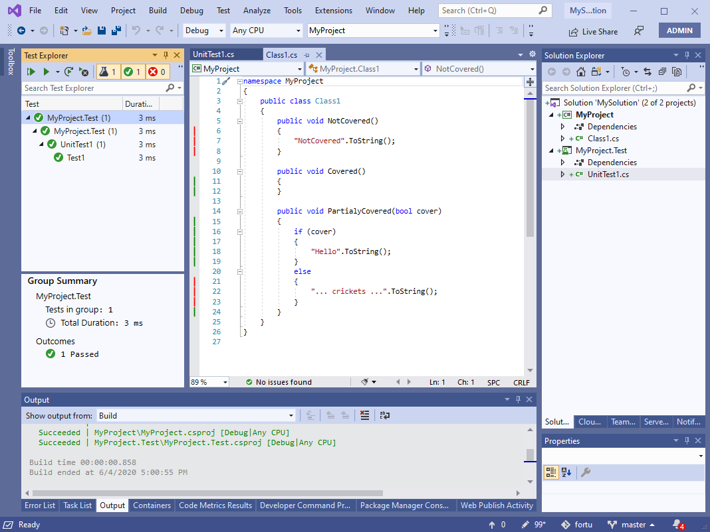
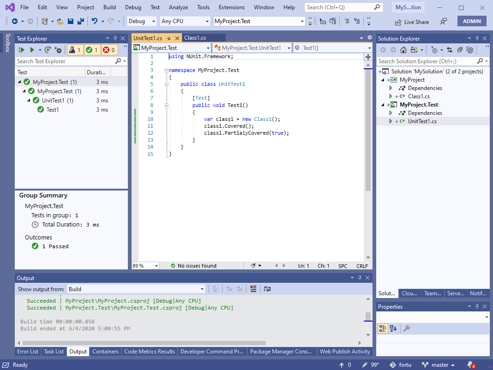

# Fine Code Coverage

<!-- Update the VS Gallery link after you upload the VSIX-->
Download this extension from the [VS Gallery](https://visualstudiogallery.msdn.microsoft.com/[GuidFromGallery])
or get the [CI build](http://vsixgallery.com/extension/fcc-339fe606-9d51-4fca-895c-d50375137b62/).

---------------------------------------

See the [change log](CHANGELOG.md) for changes and road map.

### Highlight code coverage
Run a/some unit test(s)

#### Get highlights on the code being tested

#### Get highlights on the code doing the testing

## Contribute
Check out the [contribution guidelines](CONTRIBUTING.md)
if you want to contribute to this project.

For cloning and building this project yourself, make sure
to install the
[Extensibility Tools 2015](https://visualstudiogallery.msdn.microsoft.com/ab39a092-1343-46e2-b0f1-6a3f91155aa6)
extension for Visual Studio which enables some features
used by this project.

## License
[Apache 2.0](LICENSE)