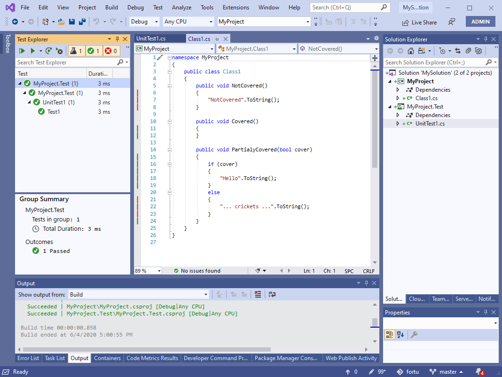
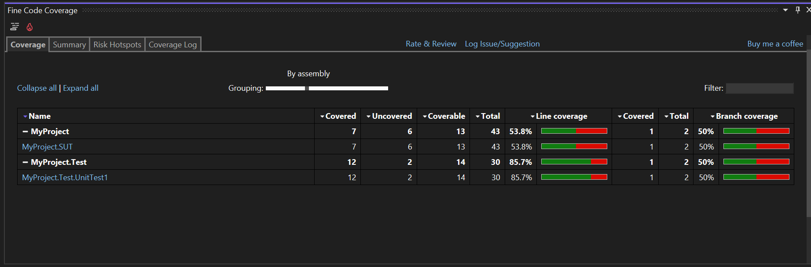
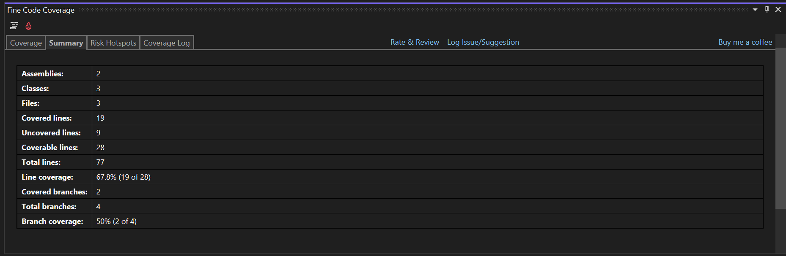
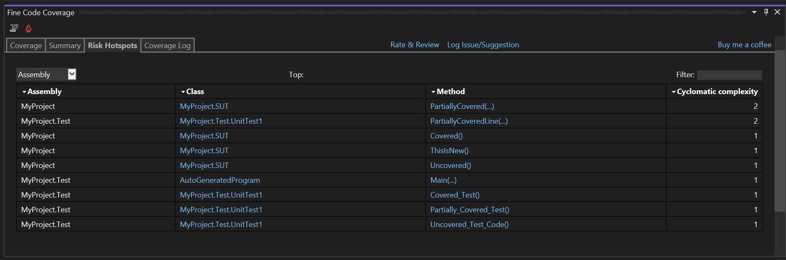
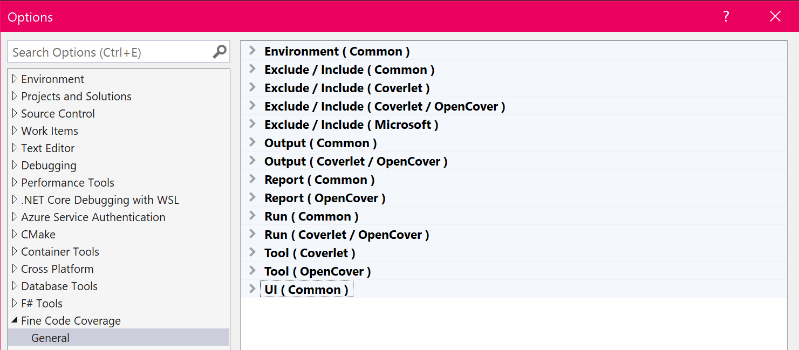

# Fine Code Coverage

[](https://ci.appveyor.com/project/FortuneN/finecodecoverage)

Download this extension from the [Visual Studio Market Place ( vs 2019 )](https://marketplace.visualstudio.com/items?itemName=FortuneNgwenya.FineCodeCoverage), [Visual Studio Market Place ( vs 2022 )](https://marketplace.visualstudio.com/items?itemName=FortuneNgwenya.FineCodeCoverage2022)
or download from [releases](https://github.com/FortuneN/FineCodeCoverage/releases).  Older versions can be obtained from [here](https://ci.appveyor.com/project/FortuneN/finecodecoverage/history).

---
## Prerequisites

Only that the test adapters are nuget packages.  For instance, the NUnit Test Adapter extension is not sufficient.

---

## Introduction

Fine Code Coverage provides code coverage using one of 3 different coverage tools.  In previous releases there were two coverage tools being utilised, OpenCover and Coverlet that will be referred to as 'old coverage'.  
Microsoft now provides a free coverage solution that you can choose to use by setting the Visual Studio Fine Code Coverage enumeration option RunMsCodeCoverage.  This will probably be the preferred coverage 
tool for most developers.  It is currently in Beta.   

With the old coverage it was possible for FCC to provide an abstraction over each tool's exclusion / inclusion options.  This abstraction does not work for MS code coverage.  
Thus you will find that there are separate configuration options for Ms coverage vs old coverage and options that are common to the two.
Configuration is ( mostly ) determined from Visual Studio options, finecodecoverage-settings.xml files and project msbuild properties.  All of these settings are optional.
For options that have a project scope, these settings form a hierarchy where lower levels override or, for collections, override or merge with the level above.  This is described in detail further on.  

Regardless of the coverage tool employed the process begins with FCC reacting to the test explorer in visual studio.  One of the 3 coverage tools provides the coverage results that are presented as a single unified report in the Fine Code Coverage Tool Window.  The report shows line and branch coverage and risk hotspots with the facility to open your class files, that will have coloured margins to indicate uncovered or partially covered code.  
This coverage is not dynamic and represents the coverage obtained from the last time you executed tests.  When the coverage becomes outdated, you can click the 'FCC Clear UI' button in Tools or run coverage again.

Details of how FCC is progressing with code coverage can be found in the Coverage Log tab in the Fine Code Coverage Tool Window with more detailed logs in the FCC Output Window Pane.  If you experience issues then providing the logs from the output window will help to understand the nature of the problem.

## Why use MS Code Coverage ?

With the old coverage FCC needed to copy your test dll and dependencies and run OpenCover or Coverlet on those files. This is not necessary with ms code coverage.
The old coverage would wait until tests have finished before starting the coverage tool to re-run all tests.  This is not necessary with ms code coverage.
The old coverage was based upon every test.  Ms code coverage is coverage from the tests you select in the test explorer.

## How to utilize MS Code Coverage with FCC ?

Firstly you need to change the RunMsCodeCoverage option from No.

Ms code coverage requires a [runsettings](https://docs.microsoft.com/en-us/visualstudio/test/configure-unit-tests-by-using-a-dot-runsettings-file?view=vs-2022) file that is configured appropriately for 
code coverage. This requires that you have the ms code coverage package and have pointed to it with the TestAdaptersPaths element as well as specifying the ms data collector.  [Exclusions and inclusions](https://docs.microsoft.com/en-us/visualstudio/test/customizing-code-coverage-analysis?view=vs-2022#include-or-exclude-assemblies-and-members) 
are also specified in the runsettings.  I don't think that the documentation is clear enough on how this works so you may want to look at [this issue](https://github.com/microsoft/vstest/issues/3462).

FCC does not require you to do this.  If you do not provide a runsettings and RunMsCodeCoverage is Yes then FCC will generate one.  If RunMsCodeCoverage is IfInRunSettings then if the project has runsettings that includes the ms data collector element configured correctly then FCC will process the collected results.

## Run settings generation from template

FCC includes the ms code coverage package and will create the necessary runsettings file for each test project being run from the test explorer window. 
The exclusions and inclusions will come from the combined settings, in a similar manner to the old coverage.  As ms code coverage uses regex and has different methods of exclusion / inclusion to 
Coverlet and OpenCover there are ms specific Visual Studio options and associated elements.

As FCC provides a runsettings file for each test project ( if you have not provided a solution wide or project specific ) it has to write the RunSettingsFilePath element in the project file.  
Although FCC clears the value of this element from the project file it is still present.

FCC creates the runsettings from a template using string replacement.  If so desired you can provide your own templates.  FCC will look for fcc-ms-runsettings-template.xml in the project directory or the solution directory.
Your template needs to be a valid xml document but does not need to supply all of the run settings elements.  FCC will add the replaceable ResultsDirectory and TestAdaptersPaths ( and the container RunConfiguration element if necessary) 
elements if not present.  FCC will also add the ms DataCollector / Configuration / CodeCoverage replaceable elements if not present.  It will also add the non exclusion / inclusion recommended CodeCoverage elements AllowLowIntegrityProcesses, CollectFromChildProcesses, CollectAspDotNet and UseVerifiableInstrumentation if not provided.  UseVerifiableInstrumentation will be false for .Net Framework.
To see the generated run settings use the RunSettingsFilePath element in the project file.  

For a custom template, that provides its own elements that would otherwise have been provided by FCC, to participate in template replacement you need to add strings of the type %fcc_replace%.  
Excludes and includes follow the format "%fcc_modulepaths_exclude%".  For FCC to supply the fcc provided ms code coverage path to TestAdaptersPaths use %fcc_testadapter%.

## Non template run settings interception
It is also possible to use your own runsettings file and have FCC add to it and replace.  FCC will ensure that the TestAdaptersPaths element is present as well as the ms data collector.  Unlike with a template, if the ms data collector is present then the xml only has replacement applied to it. 

## Run settings defaults and merging

Ms code coverage does provide a default Configuration / CodeCoverage element if not provided.  It will also add some default exclusions if not present or merge them in unless you add the attribute mergeDefaults='false'.
For instance it Attributes exclude ExcludeFromCodeCoverageAttribute.
If you are interested see ...\AppData\Local\FineCodeCoverage\msCodeCoverage\_version_\build\netstandard1.0\Microsoft.VisualStudio.TraceDataCollector.dll and the DynamicCoverageDataCollector.


## Problems with ms code coverage
Please check [troubleshooting](https://docs.microsoft.com/en-us/visualstudio/test/troubleshooting-code-coverage?view=vs-2022) before reporting an issue.

## Old style coverage

Dlls are copied to a sub folder of project output folder which may affect your tests.  The alternative is to set the option AdjacentBuildOutput to true.
The coverage is provided by either [OpenCover](https://github.com/OpenCover/opencover) for old style projects and [Coverlet](https://github.com/coverlet-coverage/coverlet) 
for new style sdk projects.  Although FCC provides an abstraction over both so that it is possible to ignore the differences between the two but there are circumstances where 
it is important to be aware of cover tool that will be run.  This is most apparent when Coverlet is used, please read on for the specifics.  
The other scenario would be when you want to use a specific version of the coverage tool. This can be configured.  

The coverage tools that FCC leverages are by default installed into the FineCodeCoverage directory within `Environment.SpecialFolder.LocalApplicationData`.
This can be changed with the ToolsDirectory Visual Studio option.  Ensure that this containing directory exists and upon restart the tools will be installed within.

---

### <a href="https://www.youtube.com/watch?v=Rae5bTE2D3o" target="_blank">Watch Introduction Video</a>

### Highlights unit test code coverage
Run a(some) unit test(s) and ...

#### Get highlights on the code being tested


#### Get highlights on the code doing the testing


#### See Coverage View


#### See Summary View


#### See Risk Hotspots View


## Project configuration

The hierarchy is as follows :

a) Visual Studio options




b) finecodecoverage-settings.xml files

These are found by walking up the directory structure from the project directory.
By applying the attribute topLevel='true' to the root element the walk stops.

Given finecodecoverage-settings.xml in project directory and finecodecoverage-settings.xml in the solution directory the 
hierachy is :

Visual Studio options

Solution level finecodecoverage-settings.xml

Project level finecodecoverage-settings.xml

```
<FineCodeCoverage>
	<Enabled>
		True
	</Enabled>
	<!-- and more -->
</FineCodeCoverage>
```

c) msbuild project file

There are two ways of supplying these settings.
Directly in the project file
```
<PropertyGroup Label="FineCodeCoverage">
  <Enabled>
	True
  </Enabled>
  <Exclude>
	[ThirdParty.*]*
	[FourthParty]*
  </Exclude>
  <Include>
	[*]*
  </Include>
  <ExcludeByFile>
	**/Migrations/*
	**/Hacks/*.cs
  </ExcludeByFile>
  <ExcludeByAttribute>
	MyCustomExcludeFromCodeCoverage
  </ExcludeByAttribute>
  <IncludeTestAssembly>
	True
  </IncludeTestAssembly>
  <ModulePathsExclude>
   .*Fabrikam.Math.UnitTest.dll
  </ModulePathsExclude>
  <!-- and more -->
</PropertyGroup>
```

With the FineCodeCoverage element.  
```
<PropertyGroup>
  <FineCodeCoverage>
    <Enabled>
	  True
    </Enabled>
    <!-- and more -->
  </FineCodeCoverage>
</PropertyGroup>
```
This is **necessary** if storing project settings outside your project file and using msbuild Import.

It is also **necessary if** you want to have the setting element merge with that from the level above as msbuild does not
support custom attributes.

### Controlling merge

The default is to overwrite each collection property.  This can be changed for all settings by setting defaultMerge='true' on the root element.

If you do supply the merge attribute on a setting element then it will be used.

### Project only

#### Exclude Referenced Project in referenced project ( csproj/vbproj : OPTIONAL )
```
<PropertyGroup>
	<FCCExcludeFromCodeCoverage/>
</PropertyGroup>			
```

#### Coverlet specific
```
<PropertyGroup>
	<UseDataCollector/>
</PropertyGroup>
```

Coverlet has different "drivers".  Fine Code Coverage has in the past only used the coverlet console driver.  This has some [issues](https://github.com/coverlet-coverage/coverlet/blob/master/Documentation/KnownIssues.md#1-vstest-stops-process-execution-earlydotnet-test) associated with it.
If you encounter **0% coverage or inconsistent coverage** it is now possible to switch to the Data Collector driver.  This is the better driver but cannot be used for all projects.
For now this is opt in.  In the future Fine Code Coverage will determine the appropriate driver.
Please consult [coverlet docs](https://github.com/coverlet-coverage/coverlet/blob/master/Documentation/VSTestIntegration.md) for version support.

**Note that it is unnecessary to add the nuget coverlet.collector package as FCC internally supplies it.**

Fine Code Coverage will use the Data Collector driver under two circumstances :
1) You are testing with runsettings that contains the coverlet collector ( and not disabled)
2) You set the UseDataCollector project property

The Coverlet Data Collector settings can be found [here](https://github.com/coverlet-coverage/coverlet/blob/master/Documentation/VSTestIntegration.md#advanced-options-supported-via-runsettings).
If you are using option 2) above then Common settings ( Exclusions and inclusions ) will be generated from project propertes ( above ) and global visual studio options (see below ) with project properties taking precedence.
If you are using option 1) then project and global options will only be used where a Common settings Configuration element is absent and the RunSettingsOnly option ( see below) has been changed to false.


#### Options
```
*** Common
CoverageColoursFromFontsAndColours Specify true to use Environment / Fonts and Colors / Text Editor for editor Coverage colouring ( if present).
                                   Coverage Touched Area / Coverage Not Touched Area / Coverage Partially Touched Area.
								   When false colours used are Green, Red and Gold.

FCCSolutionOutputDirectoryName     To have fcc output visible in a sub folder of your solution provide this name

ToolsDirectory                     Folder to which copy tools subfolder. Must alredy exist. Requires restart of VS.

ThresholdForCyclomaticComplexity   When [cyclomatic complexity](https://en.wikipedia.org/wiki/Cyclomatic_complexity) exceeds this value for a method then the method will be present in the risk hotspots tab. 

StickyCoverageTable                Set to true for coverage table to have a sticky thead.
NamespacedClasses                  Set to false to show classes in report in short form. Affects grouping.
HideFullyCovered                   Set to true to hide classes, namespaces and assemblies that are fully covered.

Enabled							   Specifies whether or not coverage output is enabled
RunWhenTestsFail				   By default coverage runs when tests fail.  Set to false to prevent this.  **Cannot be used in conjunction with RunInParallel**
RunWhenTestsExceed				   Specify a value to only run coverage based upon the number of executing tests. **Cannot be used in conjunction with RunInParallel**
RunMsCodeCoverage                  Change to IfInRunSettings to only collect with configured runsettings.  Yes for runsettings generation.

IncludeTestAssembly				   Specifies whether to report code coverage of the test assembly
IncludeReferencedProjects          Set to true to add all referenced projects to Include.

*** OpenCover / Coverlet
AdjacentBuildOutput                If your tests are dependent upon their path set this to true.

Exclude							   Filter expressions to exclude specific modules and types (multiple values)
Include							   Filter expressions to include specific modules and types (multiple values)
ExcludeByFile					   Glob patterns specifying source files to exclude e.g. **/Migrations/* (multiple values)
ExcludeByAttribute				   Attributes to exclude from code coverage (multiple values)
RunInParallel					   By default OpenCover / Coverlet tests run and then coverage is performed.  Set to true to run coverage immediately

Filter expressions
Wildcards
* => matches zero or more characters
		
Examples
[*]* => All types in all assemblies (nothing is instrumented)
[coverlet.*]Coverlet.Core.Coverage => The Coverage class in the Coverlet.Core namespace belonging to any assembly that matches coverlet.* (e.g coverlet.core)
[*]Coverlet.Core.Instrumentation.* => All types belonging to Coverlet.Core.Instrumentation namespace in any assembly
[coverlet.*.tests]* => All types in any assembly starting with coverlet. and ending with .tests


Both 'Exclude' and 'Include' options can be used together but 'Exclude' takes precedence.

You can ignore a method or an entire class from code coverage by creating and applying the [ExcludeFromCodeCoverage] attribute present in the System.Diagnostics.CodeAnalysis namespace.
You can also ignore additional attributes by adding to the 'ExcludeByAttributes' list (short name or full name supported) e.g. :
[GeneratedCode] => Present in System.CodeDom.Compiler namespace
[MyCustomExcludeFromCodeCoverage] => Any custom attribute that you may define

*** MS Code Coverage each multiple regexes to be transformed into runsettings elements
ModulePathsExclude
ModulePathsInclude
CompanyNamesExclude
CompanyNamesInclude
PublicKeyTokensExclude
PublicKeyTokensInclude
SourcesExclude
SourcesInclude
AttributesExclude
AttributesInclude
FunctionsExclude
FunctionsInclude

*** Coverlet
RunSettingsOnly					   Specify false for global and project options to be used for coverlet data collector configuration elements when not specified in runsettings
CoverletCollectorDirectoryPath	   Specify path to directory containing coverlet collector files if you need functionality that the FCC version does not provide.
CoverletConsoleLocal			   Specify true to use your own dotnet tools local install of coverlet console.
CoverletConsoleCustomPath		   Specify path to coverlet console exe if you need functionality that the FCC version does not provide.
CoverletConsoleGlobal			   Specify true to use your own dotnet tools global install of coverlet console.

The "CoverletConsole" settings have precedence Local / CustomPath / Global.

*** OpenCover
OpenCoverCustomPath                Specify path to open cover exe if you need functionality that the FCC version does not provide.
ThresholdForNPathComplexity        When [npath complexity](https://en.wikipedia.org/wiki/Cyclomatic_complexity) exceeds this value for a method then the method will be present in the risk hotspots tab. OpenCover only.
ThresholdForCrapScore              When [crap score](https://testing.googleblog.com/2011/02/this-code-is-crap.html) exceeds this value for a method then the method will be present in the risk hotspots tab. OpenCover only. 


 
```

## FCC Output
FCC outputs, by default, inside each test project's Debug folder.
If you prefer you can specify a folder to contain the files output internally and used by FCC.
Both of the methods below look for a directory containing a .sln file in an ascendant directory of the directory containing the 
first test project file.  If such a solution directory is found then the logic applies.

If the solution directory has a sub directory fcc-output then it will automatically be used.

Alternatively, if you supply FCCSolutionOutputDirectoryName in options the directory will be created if necessary and used.
 
## Contribute
Check out the [contribution guidelines](CONTRIBUTING.md)
if you want to contribute to this project.

For cloning and building this project yourself, make sure
to install the [Extensibility Tools 2015](https://visualstudiogallery.msdn.microsoft.com/ab39a092-1343-46e2-b0f1-6a3f91155aa6)
extension for Visual Studio which enables some features
used by this project.

## License
[Apache 2.0](LICENSE)

## Credits
[Coverlet](https://github.com/coverlet-coverage/coverlet)

[OpenCover](https://github.com/OpenCover/opencover)

[ReportGenerator](https://github.com/danielpalme/ReportGenerator)

## Please support the project
| Provider | Type      | Link                                                                                                                              |
|:---------|:---------:|:---------------------------------------------------------------------------------------------------------------------------------:|
| Paypal   | Once      | [](https://paypal.me/FortuneNgwenya)               |
| Librepay | Recurring | [](https://liberapay.com/FortuneN/donate)                                |
