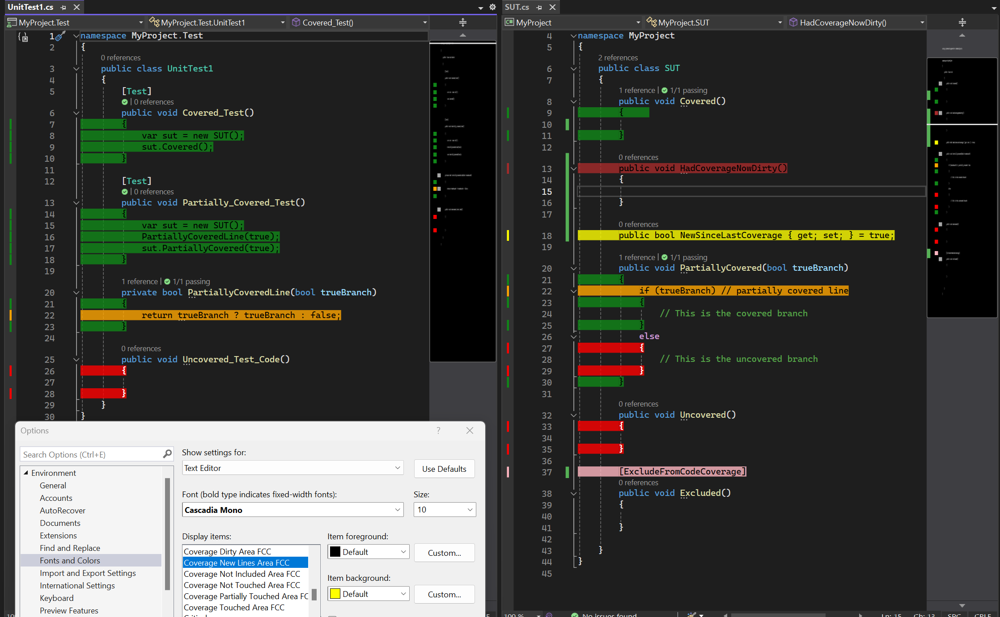
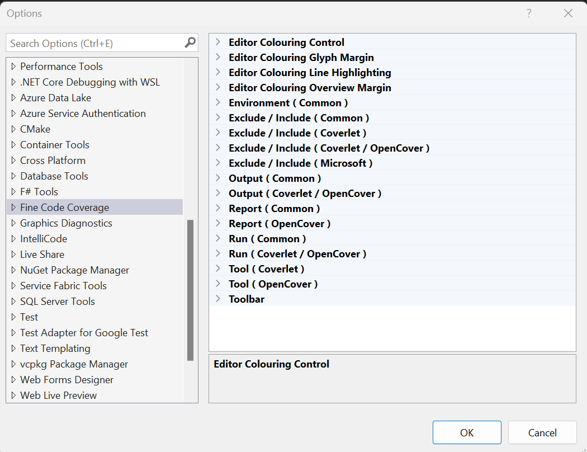

# Fine Code Coverage

[](https://youtu.be/CvrySUcTi7I)

[](https://ci.appveyor.com/project/FortuneN/finecodecoverage)

Download this extension from the [Visual Studio Market Place ( vs 2019 )](https://marketplace.visualstudio.com/items?itemName=FortuneNgwenya.FineCodeCoverage), [Visual Studio Market Place ( vs 2022 )](https://marketplace.visualstudio.com/items?itemName=FortuneNgwenya.FineCodeCoverage2022)
or download from [releases](https://github.com/FortuneN/FineCodeCoverage/releases). Older versions can be obtained from [here](https://ci.appveyor.com/project/FortuneN/finecodecoverage/history).

---

## Prerequisites

For .Net - that the test adapters are nuget packages. For instance, the NUnit Test Adapter extension is not sufficient.

---

## Introduction

Fine Code Coverage provides code coverage using one of 3 different coverage tools. In previous releases there were two coverage tools being utilised, OpenCover and Coverlet that will be referred to as 'old coverage'.  
Microsoft now provides a free coverage solution that you can choose to use by setting the Visual Studio Fine Code Coverage enumeration option RunMsCodeCoverage. This will probably be the preferred coverage
tool for most developers. It is currently in Beta.

With the old coverage it was possible for FCC to provide an abstraction over each tool's exclusion / inclusion options. This abstraction does not work for MS code coverage.  
Thus you will find that there are separate configuration options for Ms coverage vs old coverage and options that are common to the two.
Assembly level exclusions and inclusions can be achieved - see ExcludeAssemblies and IncludeAssemblies.
Configuration is ( mostly ) determined from Visual Studio options, finecodecoverage-settings.xml files and project msbuild properties. All of these settings are optional.
For options that have a project scope, these settings form a hierarchy where lower levels override or, for collections, override or merge with the level above. This is described in detail further on.

Regardless of the coverage tool employed the process begins with FCC reacting to the test explorer in visual studio. One of the 3 coverage tools provides the coverage results and the results can be opened from buttons on the Fine Code Coverage Tool Window.
This coverage is not dynamic and represents the coverage obtained from the last time you executed tests. When the coverage becomes outdated, you can click the 'FCC Clear UI' button in Tools or run coverage again.

Details of how FCC is progressing with code coverage can be found in the Coverage Log tab in the Fine Code Coverage Tool Window with more detailed logs in the FCC Output Window Pane. If you experience issues then providing the logs from the output window will help to understand the nature of the problem.

### Coverage Result Presentation

### Report

Present a single unified report in the Fine Code Coverage Tool Window. The report shows line and branch coverage and risk hotspots with the facility to open your class files.

### Editor

Coloured margins to indicate the coverage status of your code. Instrumented ( included and analysable) lines of code are either covered, uncovered or partially covered which means that not all branches were executed.

FCC provides the concept of dirty regions where previously instrumented code will no longer show instrumented status once you have change the code.

For C# and Visual Basic provides further coverage information :

FCC also allows you to see code that was not included in coverage and new lines that have been added since the last coverage run.

Both dirty and new line colouring needs to be turned on in options.

If desired, lines can be highlighted too by setting the available Visual Studio options. Read on for more details.

The colours can be controlled via Visual Studio / Tools / Options / Environment / Fonts and Colors / Text Editor / Display Items :

For Visual Studio Community, Professional and Enterprise you can use the settings

Coverage Touched Area FCC

Coverage Partially Touched Area FCC

Coverage Not Touched Area FCC

Coverage Dirty Area FCC

Coverage New Lines Area FCC

Coverage Not Included Area FCC

For versions that supply the items below FCC will use these by default over the equivalent FCC items so that colours defined in themes can be used.
If you wish to be consistent for the 5 available items you can set UseEnterpriseFontsAndColors to false.

Coverage Not Touched Area

Coverage Partially Touched Area

Coverage Touched Area

You can turn off editor colouring by setting the visual studio option EditorCoverageColouringMode to Off.
You can also set the option to DoNotUseRoslynWhenTextChanges if there is a performance issue. By doing so new lines colouring will not be as good.
If you switch to one of the EditorCoverageColouringMode options then you will need to re-run coverage.

You can toggle editor colouring. FCC adds a menu button, Toggle Indicators, in the Tools menu. You can also create a keyboard shortcut -
Tools / Options / Environment / Keyboard, show commands containing "ToggleIndicators".

For Blazor components with @code blocks coverage lines can be generated outside these regions.
When the Roslyn syntax tree is available to FCC you can set the option BlazorCoverageLinesFromGeneratedSource to true to limit coverage lines in .razor file to those in generated source.

FCC tracks the visual studio editor and saves this information when a file is closed. If upon re-opening a file the text has changed outside of a document window there will be no coverage marks for this file as the coverage lines are no longer expected to be correct..

There will also be no editor marks if you edit a file whilst FCC is collecting coverage.

## Why use MS Code Coverage ?

With the old coverage FCC needed to copy your test dll and dependencies and run OpenCover or Coverlet on those files. This is not necessary with ms code coverage.
The old coverage would wait until tests have finished before starting the coverage tool to re-run all tests. This is not necessary with ms code coverage.
The old coverage was based upon every test. Ms code coverage is coverage from the tests you select in the test explorer.

**Supports C++ !** Note that FCC has not been properly tested with C++ projects but with a simple C++ class, tested with Google Test, FCC provides coverage.

## How to utilize MS Code Coverage with FCC ?

Firstly you need to change the RunMsCodeCoverage option from No.

Ms code coverage requires a [runsettings](https://docs.microsoft.com/en-us/visualstudio/test/configure-unit-tests-by-using-a-dot-runsettings-file?view=vs-2022) file that is configured appropriately for
code coverage. This requires that you have the ms code coverage package and have pointed to it with the TestAdaptersPaths element as well as specifying the ms data collector. [Exclusions and inclusions](https://docs.microsoft.com/en-us/visualstudio/test/customizing-code-coverage-analysis?view=vs-2022#include-or-exclude-assemblies-and-members)
are also specified in the runsettings. I don't think that the documentation is clear enough on how this works so you may want to look at [this issue](https://github.com/microsoft/vstest/issues/3462).

FCC does not require you to do this. If you do not provide a runsettings and RunMsCodeCoverage is Yes then FCC will generate one and write the necessary entry in the project file.  
Note that having a test project file open in visual studio whilst running tests may result in a conflict warning when FCC removes the entry at the end of the test.
If RunMsCodeCoverage is IfInRunSettings then if the project has runsettings that includes the ms data collector element configured correctly then FCC will process the collected results.

## Run settings generation from template

FCC includes the ms code coverage package and will create the necessary runsettings file for each test project being run from the test explorer window.
The exclusions and inclusions will come from the combined settings, in a similar manner to the old coverage. As ms code coverage uses regex and has different methods of exclusion / inclusion to
Coverlet and OpenCover there are ms specific Visual Studio options and associated elements.

As FCC provides a runsettings file for each test project ( if you have not provided a solution wide or project specific ) it has to write the RunSettingsFilePath element in the project file.  
Although FCC clears the value of this element from the project file it is still present.

FCC creates the runsettings from a template using string replacement. If so desired you can provide your own templates. FCC will look for fcc-ms-runsettings-template.xml in the project directory or the solution directory.
Your template needs to be a valid xml document but does not need to supply all of the run settings elements. FCC will add the replaceable ResultsDirectory and TestAdaptersPaths ( and the container RunConfiguration element if necessary)
elements if not present. FCC will also add the ms DataCollector / Configuration / CodeCoverage replaceable elements if not present. It will also add the non exclusion / inclusion recommended CodeCoverage elements AllowLowIntegrityProcesses, CollectFromChildProcesses, CollectAspDotNet and UseVerifiableInstrumentation if not provided. UseVerifiableInstrumentation will be false for .Net Framework.
To see the generated run settings use the RunSettingsFilePath element in the project file.

For a custom template, that provides its own elements that would otherwise have been provided by FCC, to participate in template replacement you need to add strings of the type %fcc_replace%.  
Excludes and includes follow the format "%fcc_modulepaths_exclude%". For FCC to supply the fcc provided ms code coverage path to TestAdaptersPaths use %fcc_testadapter%.

## Non template run settings interception

It is also possible to use your own runsettings file and have FCC add to it and replace. FCC will ensure that the TestAdaptersPaths element is present as well as the ms data collector. Unlike with a template, if the ms data collector is present then the xml only has replacement applied to it.

## Run settings defaults and merging

Ms code coverage does provide a default Configuration / CodeCoverage element if not provided. It will also add some default exclusions if not present or merge them in unless you add the attribute mergeDefaults='false'.
For instance it Attributes exclude ExcludeFromCodeCoverageAttribute.
If you are interested see ...\AppData\Local\FineCodeCoverage\msCodeCoverage_version\_\build\netstandard1.0\Microsoft.VisualStudio.TraceDataCollector.dll and the DynamicCoverageDataCollector.

## Problems with ms code coverage

Please check [troubleshooting](https://docs.microsoft.com/en-us/visualstudio/test/troubleshooting-code-coverage?view=vs-2022) before reporting an issue.

## Old style coverage

Dlls are copied to a sub folder of project output folder which may affect your tests. The alternative is to set the option AdjacentBuildOutput to true.
The coverage is provided by either [OpenCover](https://github.com/OpenCover/opencover) for old style projects and [Coverlet](https://github.com/coverlet-coverage/coverlet)
for new style sdk projects. Although FCC provides an abstraction over both so that it is possible to ignore the differences between the two but there are circumstances where
it is important to be aware of cover tool that will be run. This is most apparent when Coverlet is used, please read on for the specifics.  
The other scenario would be when you want to use a specific version of the coverage tool. This can be configured.

The coverage tools that FCC leverages are by default installed into the FineCodeCoverage directory within `Environment.SpecialFolder.LocalApplicationData`.
This can be changed with the ToolsDirectory Visual Studio option. Ensure that this containing directory exists and upon restart the tools will be installed within.

---

### Highlights unit test code coverage

Run a(some) unit test(s) and ...

#### Get highlights on the code being tested and the code doing the testing



#### Report Coverage View


#### Report Summary View


#### Report Risk Hotspots View


## Project configuration

The hierarchy is as follows :

a) Visual Studio options



b) finecodecoverage-settings.xml files

These are found by walking up the directory structure from the project directory.
By applying the attribute topLevel='true' to the root element the walk stops.

Given finecodecoverage-settings.xml in project directory and finecodecoverage-settings.xml in the solution directory the
hierachy is :

Visual Studio options

Solution level finecodecoverage-settings.xml

Project level finecodecoverage-settings.xml

```
<FineCodeCoverage>
	<Enabled>
		True
	</Enabled>
	<!-- and more -->
</FineCodeCoverage>
```

c) msbuild project file

There are two ways of supplying these settings.
Directly in the project file

```
<PropertyGroup Label="FineCodeCoverage">
  <Enabled>
	True
  </Enabled>
  <Exclude>
	[ThirdParty.*]*
	[FourthParty]*
  </Exclude>
  <Include>
	[*]*
  </Include>
  <ExcludeByFile>
	**/Migrations/*
	**/Hacks/*.cs
  </ExcludeByFile>
  <ExcludeByAttribute>
	MyCustomExcludeFromCodeCoverage
  </ExcludeByAttribute>
  <IncludeTestAssembly>
	True
  </IncludeTestAssembly>
  <ModulePathsExclude>
   .*Fabrikam.Math.UnitTest.dll
  </ModulePathsExclude>
  <!-- and more -->
</PropertyGroup>
```

With the FineCodeCoverage element.

```
<PropertyGroup>
  <FineCodeCoverage>
    <Enabled>
	  True
    </Enabled>
    <!-- and more -->
  </FineCodeCoverage>
</PropertyGroup>
```

This is **necessary** if storing project settings outside your project file and using msbuild Import.

It is also **necessary if** you want to have the setting element merge with that from the level above as msbuild does not
support custom attributes.

### Controlling merge

The default is to overwrite each collection property. This can be changed for all settings by setting defaultMerge='true' on the root element.

If you do supply the merge attribute on a setting element then it will be used.

### Project only

#### Exclude Referenced Project in referenced project ( csproj/vbproj : OPTIONAL )

This is not transitive.

```
<PropertyGroup>
	<FCCExcludeFromCodeCoverage/>
</PropertyGroup>
```

#### Coverlet specific

```
<PropertyGroup>
	<UseDataCollector/>
</PropertyGroup>
```

Coverlet has different "drivers". Fine Code Coverage has in the past only used the coverlet console driver. This has some [issues](https://github.com/coverlet-coverage/coverlet/blob/master/Documentation/KnownIssues.md#1-vstest-stops-process-execution-earlydotnet-test) associated with it.
If you encounter **0% coverage or inconsistent coverage** it is now possible to switch to the Data Collector driver. This is the better driver but cannot be used for all projects.
For now this is opt in. In the future Fine Code Coverage will determine the appropriate driver.
Please consult [coverlet docs](https://github.com/coverlet-coverage/coverlet/blob/master/Documentation/VSTestIntegration.md) for version support.

**Note that it is unnecessary to add the nuget coverlet.collector package as FCC internally supplies it.**

Fine Code Coverage will use the Data Collector driver under two circumstances :

1. You are testing with runsettings that contains the coverlet collector ( and not disabled)
2. You set the UseDataCollector project property

The Coverlet Data Collector settings can be found [here](https://github.com/coverlet-coverage/coverlet/blob/master/Documentation/VSTestIntegration.md#advanced-options-supported-via-runsettings).
If you are using option 2) above then Common settings ( Exclusions and inclusions ) will be generated from project propertes ( above ) and global visual studio options (see below ) with project properties taking precedence.
If you are using option 1) then project and global options will only be used where a Common settings Configuration element is absent and the RunSettingsOnly option ( see below) has been changed to false.

#### Options

| Option                                                                          | Description                                                                                                                                                                                                                                                                                                                                                    |
| ------------------------------------------------------------------------------- | -------------------------------------------------------------------------------------------------------------------------------------------------------------------------------------------------------------------------------------------------------------------------------------------------------------------------------------------------------------- |
| **Common**                                                                      |                                                                                                                                                                                                                                                                                                                                                                |
| EditorCoverageColouringMode                                                     | Set to Off, or Set to DoNotUseRoslynWhenTextChanges if there is a performance issue                                                                                                                                                                                                                                                                            |
| BlazorCoverageLinesFromGeneratedSource                                          | Set to true to limit coverage lines in .razor file to those in generated source ( when available)                                                                                                                                                                                                                                                              |
| ShowEditorCoverage                                                              | Set to false to disable all editor coverage indicators                                                                                                                                                                                                                                                                                                         |
| ShowCoverageInGlyphMargin                                                       | Set to false to prevent coverage marks in the glyph margin                                                                                                                                                                                                                                                                                                     |
| ShowCoveredInGlyphMargin                                                        | Set to false to prevent covered marks in the glyph margin                                                                                                                                                                                                                                                                                                      |
| ShowUncoveredInGlyphMargin                                                      | Set to false to prevent uncovered marks in the glyph margin                                                                                                                                                                                                                                                                                                    |
| ShowPartiallyCoveredInGlyphMargin                                               | Set to false to prevent partially covered marks in the glyph margin                                                                                                                                                                                                                                                                                            |
| ShowDirtyInGlyphMargin                                                          | Set to true to show dirty marks in the glyph margin                                                                                                                                                                                                                                                                                                            |
| ShowNewInGlyphMargin                                                            | Set to true to show new line marks in the glyph margin                                                                                                                                                                                                                                                                                                         |
| ShowCoverageInOverviewMargin                                                    | Set to false to prevent coverage marks in the overview margin                                                                                                                                                                                                                                                                                                  |
| ShowCoveredInOverviewMargin                                                     | Set to false to prevent covered marks in the overview margin                                                                                                                                                                                                                                                                                                   |
| ShowUncoveredInOverviewMargin                                                   | Set to false to prevent uncovered marks in the overview margin                                                                                                                                                                                                                                                                                                 |
| ShowPartiallyCoveredInOverviewMargin                                            | Set to false to prevent partially covered marks in the overview margin                                                                                                                                                                                                                                                                                         |
| ShowDirtyInOverviewMargin                                                       | Set to true to show dirty marks in the overview margin                                                                                                                                                                                                                                                                                                         |
| ShowNewInOverviewMargin                                                         | Set to true to show new line marks in the overview margin                                                                                                                                                                                                                                                                                                      |
| ShowLineCoverageHighlighting                                                    | Set to true to allow coverage line highlighting                                                                                                                                                                                                                                                                                                                |
| ShowLineCoveredHighlighting                                                     | Set to false to prevent covered line highlighting                                                                                                                                                                                                                                                                                                              |
| ShowLineUncoveredHighlighting                                                   | Set to false to prevent uncovered line highlighting                                                                                                                                                                                                                                                                                                            |
| ShowLinePartiallyCoveredHighlighting                                            | Set to false to prevent partially covered line highlighting                                                                                                                                                                                                                                                                                                    |
| ShowLineDirtyHighlighting                                                       | Set to true to show dirty line highlighting                                                                                                                                                                                                                                                                                                                    |
| ShowLineNewHighlighting                                                         | Set to true to show new line highlighting                                                                                                                                                                                                                                                                                                                      |
| UseEnterpriseFontsAndColors                                                     | Set to false to use FCC Fonts And Colors items                                                                                                                                                                                                                                                                                                                 |
| ShowToolWindowToolbar                                                           | Set to false to hide the toolbar on the tool window. Requires restarting Visual Studio. The toolbar has buttons for viewing the Cobertura xml and the risk hotspots.                                                                                                                                                                                           |
| FCC Solution Output Directory Name                                              | To have fcc output visible in a sub folder of your solution provide this name                                                                                                                                                                                                                                                                                  |
| ToolsDirectory                                                                  | Folder to which copy tools subfolder. Must alredy exist. Requires restart of VS.                                                                                                                                                                                                                                                                               |
| ThresholdForCyclomaticComplexity                                                | When [cyclomatic complexity](https://en.wikipedia.org/wiki/Cyclomatic_complexity) exceeds this value for a method then the method will be present in the risk hotspots tab.                                                                                                                                                                                    |
| StickyCoverageTable                                                             | Set to true for coverage table to have a sticky thead.                                                                                                                                                                                                                                                                                                         |
| NamespacedClasses                                                               | Set to false to show types in report in short form. Affects grouping.                                                                                                                                                                                                                                                                                          |
| NamespaceQualification                                                          | Control qualification of types in report when NamespacedClasses is true.<br>FullyQualified - always fully qualify.<br>AlwaysUnqualified - always unqualified.<br>UnqualifiedByNamespace - unqualified when grouping by namespace.<br>QualifiedByNamespaceLevel - omits the first grouping level identifier parts. Reduces space whilst maintaining uniqueness. |
| HideFullyCovered                                                                | Set to true to hide classes, namespaces and assemblies that are fully covered.                                                                                                                                                                                                                                                                                 |
| Hide0Coverage                                                                   | Set to true to hide classes, namespaces and assemblies that have 0% coverage.                                                                                                                                                                                                                                                                                  |
| Hide0Coverable                                                                  | Set to false to show classes, namespaces and assemblies that are not coverable.                                                                                                                                                                                                                                                                                |
| Enabled                                                                         | Specifies whether or not coverage output is enabled                                                                                                                                                                                                                                                                                                            |
| DisabledNoCoverage                                                              | Set to false for VS Option Enabled=false to not disable coverage                                                                                                                                                                                                                                                                                               |
| RunWhenTestsFail                                                                | By default coverage runs when tests fail. Set to false to prevent this. **Cannot be used in conjunction with RunInParallel**                                                                                                                                                                                                                                   |
| RunWhenTestsExceed                                                              | Specify a value to only run coverage based upon the number of executing tests. **Cannot be used in conjunction with RunInParallel**                                                                                                                                                                                                                            |
| RunMsCodeCoverage                                                               | Change to IfInRunSettings to only collect with configured runsettings. Yes for runsettings generation.                                                                                                                                                                                                                                                         |
| IncludeTestAssembly                                                             | Specifies whether to report code coverage of the test assembly                                                                                                                                                                                                                                                                                                 |
| IncludeReferencedProjects                                                       | Set to true to add all directly referenced projects to Include.                                                                                                                                                                                                                                                                                                |
| IncludeAssemblies                                                               | Provide a list of assemblies to include in coverage. The dll name without extension is used for matching.                                                                                                                                                                                                                                                      |
| ExcludeAssemblies                                                               | Provide a list of assemblies to exclude from coverage. The dll name without extension is used for matching.                                                                                                                                                                                                                                                    |
| <br>                                                                            |                                                                                                                                                                                                                                                                                                                                                                |
| **OpenCover / Coverlet**                                                        |                                                                                                                                                                                                                                                                                                                                                                |
| AdjacentBuildOutput                                                             | If your tests are dependent upon their path set this to true.                                                                                                                                                                                                                                                                                                  |
| Exclude                                                                         | Filter expressions to exclude specific modules and types (multiple values)                                                                                                                                                                                                                                                                                     |
| Include                                                                         | Filter expressions to include specific modules and types (multiple values)                                                                                                                                                                                                                                                                                     |
| ExcludeByFile                                                                   | OpenCover uses \* wildcard matching. Coverlet uses [file system globbing](https://learn.microsoft.com/en-us/dotnet/api/microsoft.extensions.filesystemglobbing.matcher?view=dotnet-plat-ext-8.0)                                                                                                                                                               |
| ExcludeByAttribute                                                              | Exclude attributed code at assembly, type and method level. Add fully qualified or unqualified attribute types.                                                                                                                                                                                                                                                |
| RunInParallel                                                                   | By default OpenCover / Coverlet tests run and then coverage is performed. Set to true to run coverage immediately                                                                                                                                                                                                                                              |
| <br>                                                                            |                                                                                                                                                                                                                                                                                                                                                                |
| **Ms code coverage**                                                            | Each of below is an array of regexes to be transformed into runsettings elements [see](https://learn.microsoft.com/en-us/visualstudio/test/customizing-code-coverage-analysis?view=vs-2022#include-or-exclude-assemblies-and-members)                                                                                                                          |
| ModulePathsExclude                                                              | Exclude - Matches assemblies specified by assembly name or file path.                                                                                                                                                                                                                                                                                          |
| ModulePathsInclude                                                              | Include - Matches assemblies specified by assembly name or file path.                                                                                                                                                                                                                                                                                          |
| CompanyNamesExclude                                                             | Exclude - Matches assemblies by the Company attribute.                                                                                                                                                                                                                                                                                                         |
| CompanyNamesInclude                                                             | Include - Matches assemblies by the Company attribute.                                                                                                                                                                                                                                                                                                         |
| PublicKeyTokens Exclude                                                         | Exclude - Matches signed assemblies by the public key token.                                                                                                                                                                                                                                                                                                   |
| PublicKeyTokens Include                                                         | Include - Matches signed assemblies by the public key token.                                                                                                                                                                                                                                                                                                   |
| SourcesExclude                                                                  | Exclude - Matches elements by the path name of the source file in which they're defined.                                                                                                                                                                                                                                                                       |
| SourcesInclude                                                                  | Include - Matches elements by the path name of the source file in which they're defined.                                                                                                                                                                                                                                                                       |
| AttributesExclude                                                               | Exclude - Matches elements that have the specified attribute. Specify the full name of the attribute                                                                                                                                                                                                                                                           |
| AttributesInclude                                                               | Include - Matches elements that have the specified attribute. Specify the full name of the attribute                                                                                                                                                                                                                                                           |
| FunctionsExclude                                                                | Exclude - Matches procedures, functions, or methods by fully qualified name, including the parameter list.                                                                                                                                                                                                                                                     |
| FunctionsInclude                                                                | Include - Matches procedures, functions, or methods by fully qualified name, including the parameter list.                                                                                                                                                                                                                                                     |
| <br>                                                                            |                                                                                                                                                                                                                                                                                                                                                                |
| **Coverlet**                                                                    |                                                                                                                                                                                                                                                                                                                                                                |
| RunSettingsOnly                                                                 | Specify false for global and project options to be used for coverlet data collector configuration elements when not specified in runsettings                                                                                                                                                                                                                   |
| CoverletCollectorDirectoryPath                                                  | Specify path to directory containing coverlet collector files if you need functionality that the FCC version does not provide.                                                                                                                                                                                                                                 |
| CoverletConsoleLocal                                                            | Specify true to use your own dotnet tools local install of coverlet console.                                                                                                                                                                                                                                                                                   |
| CoverletConsoleCustomPath                                                       | Specify path to coverlet console exe if you need functionality that the FCC version does not provide.                                                                                                                                                                                                                                                          |
| CoverletConsoleGlobal                                                           | Specify true to use your own dotnet tools global install of coverlet console.                                                                                                                                                                                                                                                                                  |
| **The "CoverletConsole" settings have precedence Local / CustomPath / Global.** |                                                                                                                                                                                                                                                                                                                                                                |
| <br>                                                                            |                                                                                                                                                                                                                                                                                                                                                                |
| **OpenCover**                                                                   |                                                                                                                                                                                                                                                                                                                                                                |
| OpenCoverRegister                                                               | Change from Default if FCC determination of path32 or path64 is incorrect.                                                                                                                                                                                                                                                                                     |
| OpenCoverTarget                                                                 | Supply your own target if required.                                                                                                                                                                                                                                                                                                                            |
| OpenCoverTargetArgs                                                             | If supplying your own target you can also supply additional arguments. FCC supplies the test dll path.                                                                                                                                                                                                                                                         |
| OpenCoverCustomPath                                                             | Specify path to open cover exe if you need functionality that the FCC version does not provide.                                                                                                                                                                                                                                                                |
| ThresholdForNPathComplexity                                                     | When [npath complexity](https://en.wikipedia.org/wiki/Cyclomatic_complexity) exceeds this value for a method then the method will be present in the risk hotspots tab.                                                                                                                                                                                         |
| ThresholdForCrapScore                                                           | When [crap score](https://testing.googleblog.com/2011/02/this-code-is-crap.html) exceeds this value for a method then the method will be present in the risk hotspots tab.                                                                                                                                                                                     |

## Exclusions and inclusions

You probably want to set IncludeReferencedProjects to true. This will ensure that you do not get coverage for testing frameworks - only your code.

Coverlet and OpenCover use filter expressions.
Filter expressions

Wildcards

\* => matches zero or more characters
Examples

[\*]\* => All types in all assemblies.

[coverlet\.\*]Coverlet.Core.Coverage => The Coverage class in the Coverlet.Core namespace belonging to any assembly that matches coverlet.\* (e.g coverlet.core)

[\*\]Coverlet.Core.Instrumentation.\* => All types belonging to Coverlet.Core.Instrumentation namespace in any assembly

[coverlet\.\*.tests]\* => All types in any assembly starting with coverlet. and ending with .tests

Both 'Exclude' and 'Include' options can be used together but 'Exclude' takes precedence.

Ms code coverage uses [regexes](https://learn.microsoft.com/en-us/visualstudio/test/customizing-code-coverage-analysis?view=vs-2022#regular-expressions).
You can include or exclude assemblies or specific types and members from code coverage analysis. If the Include section is empty or omitted, then all assemblies that are loaded and have associated PDB files are included. If an assembly or member matches a clause in the Exclude section, then it is excluded from code coverage. The Exclude section takes precedence over the Include section: if an assembly is listed in both Include and Exclude, it will not be included in code coverage.

You can ignore a method or an entire class from code coverage by applying the [ExcludeFromCodeCoverage] attribute present in the System.Diagnostics.CodeAnalysis namespace.

For .Net ( not .Net Framework ) this attribute can be applied at the assembly level.

For .Net Framework see FCCExcludeFromCodeCoverage, above, for similar functionality.

To ignore code attributed with a different type:

You can also ignore additional attributes by adding to the 'ExcludeByAttribute' list
For Coverlet/OpenCover add to adding to the 'ExcludeByAttribute' list ( fully qualified or unqualified).
For ms code coverage add to the 'AttributesExclude' list. This uses regex matching.

## FCC Output

FCC outputs, by default, inside each test project's Debug folder.
If you prefer you can specify a folder to contain the files output internally and used by FCC.
Both of the methods below look for a directory containing a .sln file in an ascendant directory of the directory containing the
first test project file. If such a solution directory is found then the logic applies.

If the solution directory has a sub directory fcc-output then it will automatically be used.

Alternatively, if you supply FCCSolutionOutputDirectoryName in options the directory will be created if necessary and used.

## Contribute

Check out the [contribution guidelines](CONTRIBUTING.md)
if you want to contribute to this project.

For cloning and building this project yourself, make sure
to install the [Extensibility Essentials](https://marketplace.visualstudio.com/items?itemName=MadsKristensen.ExtensibilityEssentials2022)
extension for Visual Studio which enables some features
used by this project. 

## License

[Apache 2.0](LICENSE)

## Credits 

[Coverlet](https://github.com/coverlet-coverage/coverlet)

[OpenCover](https://github.com/OpenCover/opencover)

[ReportGenerator](https://github.com/danielpalme/ReportGenerator) 

## Please support the project

| Provider  |   Type    |                                                        Link                                                         |
| :-------- | :-------: | :-----------------------------------------------------------------------------------------------------------------: |
| Paypal    |   Once    | [](https://paypal.me/FortuneNgwenya) |
| Liberapay | Recurring |         [](https://liberapay.com/FortuneN/donate)          |
